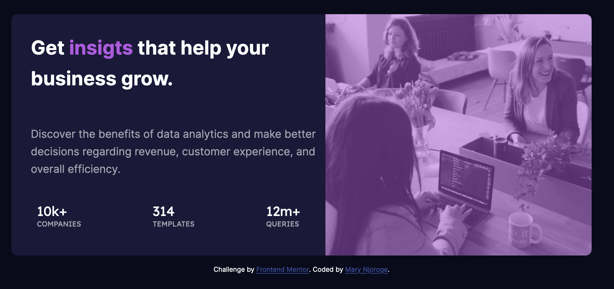

# Frontend Mentor - Stats preview card component solution

This is a solution to the [Stats preview card component challenge on Frontend Mentor](https://www.frontendmentor.io/challenges/stats-preview-card-component-8JqbgoU62). Frontend Mentor challenges help you improve your coding skills by building realistic projects. 

## Table of contents

- [Overview](#overview)
  - [The challenge](#the-challenge)
  - [Screenshot](#screenshot)
  - [Links](#links)
- [My process](#my-process)
  - [Built with](#built-with)
  - [What I learned](#what-i-learned)
  - [Useful resources](#useful-resources)
- [Author](#author)
- [Acknowledgments](#acknowledgments)


## Overview
This challenge helped me practice more positioning styles for my container. Media queries too were a huge part of ensuring that my project can be seen both in mobile and desktop view.
### The challenge

Users should be able to:

- View the optimal layout depending on their device's screen size

### Screenshot




### Links

- Solution URL: [Github](https://github.com/Maryahcee/Stats-preview-card-component)
- Live Site URL: [ ](https://stats-card-component-preview.netlify.app/)

## My process
I used mobile first approach.
### Built with

- Semantic HTML5 markup
- CSS custom properties
- Flexbox
- Mobile-first workflow
### What I learned

Working on this project was a bit challenging especially while positioninig the images to look as required in the desktop version. However I managed to pull through using flexbox.
Adding the overlay was something I have never done and this was a good opportunity to learn how to add the overlay and even play around with the opacity.

```css
.container .picture .overlay{
   background-color: var(--Soft-violet);
   height: 500px;
   opacity: .5;
}
```

### Useful resources

- [ resource 1](https://www.w3schools.com/) - This helped me to know how to add an overlay in the background of my image. I really liked this pattern and will use it going forward.

## Author

- Frontend Mentor - [Mary Njoroge](https://www.frontendmentor.io/profile/Maryahcee)

## Acknowledgments

Special thanks to Harrison Kimani for the continued support.
